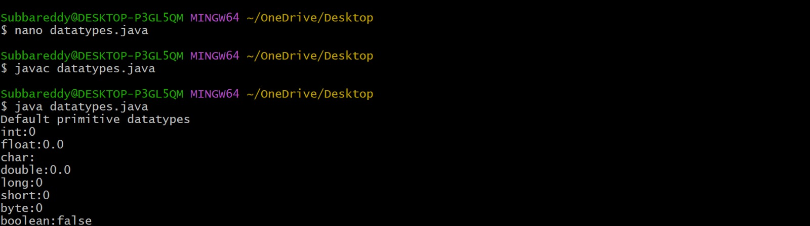

# JAVALAB

# Expt-1a
```java
class Test {
    byte b;
    int i;
    float f;
    char c;
    double d;
    long l;
    short s;
    boolean bl;

    public static void main(String[] args) {
        Test t = new Test();
        System.out.println(t.b);
        System.out.println(t.i);
        System.out.println(t.f);
        System.out.println(t.c);
        System.out.println(t.d);
        System.out.println(t.l);
        System.out.println(t.s);
        System.out.println(t.bl);
        
    }
}

```
# output:

